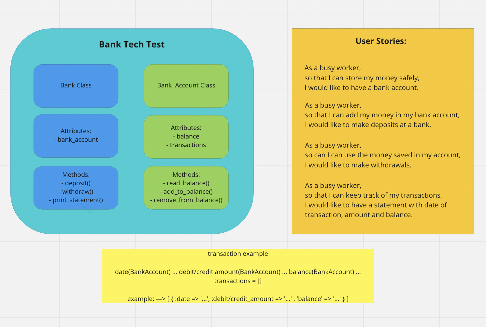

# Bank Tech Test

A simple program that simulates a bank and its basic functionalities.

---

# Getting Started
## Installation

1. Clone the repo
```
  git clone https://github.com/Riky5/bank_tech_test.git
```
2. Install gems
```
  bundle install
```
3. Run tests
```
  rspec
```

# Usage

1. In a terminal start irb with the required files:
```
  irb -r ./lib/bank.rb -r ./lib/bank_account.rb
```
2. Create a bank account:
```
  3.0.2 :001 > my_account = BankAccount.new(500)
  => #<BankAccount:0x00000001451cd180 @balance=0, @overdraft_limit=400, @transactions=[]> 
```
3. Add your account to the bank:
```
  3.0.2 :002 > my_bank = Bank.new(my_account)
  => #<Bank:0x00000001450be208 @account=#<BankAccount:0x00000001451cd180 @balance=0, @overdraft_limit=400, @transactions=[]>> 
```
4. Make a deposit (example)
```
  3.0.2 :003 > my_bank.make_deposit(3000)
  => [{:date=>"31/01/2022", :credit=>3000, :debit=>0, :balance=>3000}] 
```
5. Withdraw some money (example)
```
  3.0.2 :004 > my_bank.withdraw_money(600)
  => 
  [{:date=>"31/01/2022", :credit=>3000, :debit=>0, :balance=>3000},
  {:date=>"01/02/2022", :credit=>0, :debit=>600, :balance=>2400}] 
```
6. You can withdraw more than you have if you set up an overdraft limit when creating the account (in our example we have 500 overdraft limit)
```
  3.0.2 :017 > my_bank.withdraw_money(2600)
  => 
  [{:date=>"01/02/2022", :credit=>3000, :debit=>0, :balance=>3000},
 {:date=>"01/02/2022", :credit=>0, :debit=>600, :balance=>2400},
 {:date=>"01/02/2022", :credit=>0, :debit=>2600, :balance=>-200}] 
```
7. It is not possible to withdraw more than the overdraft limit
```
  3.0.2 :018 > my_bank.withdraw_money(400)
  /Users/rikytraveller/Projects/Bank-Tech-Test/lib/bank_account.rb:28:in `check_overdraft': Denied! You cannot withdraw more than your overdraft limit! (RuntimeError)
```
8. Print a statement
```
 3.0.2 :019 > my_bank.print_statement
  date       || credit  ||  debit  || balance
  01/02/2022 ||    0.00 || 2600.00 || -200.00          
  01/02/2022 ||    0.00 ||  600.00 || 2400.00          
  31/01/2022 || 3000.00 ||    0.00 || 3000.00  
```

---
### User Stories, Diagramming, Planning



Approach:

Based on user stories created I have decided to have 2 classes. 
- Bank Account
- Bank

Bank is where the user mainly interacts with the program. I have visualised the bank class as an ATM where the user can make_deposit(), withdraw_money() and print_statement().

BankAccount is what's happening behind the scene. It's where the balance and transactions are stored. It has 4 methods read_balance(), add_to_balance(), remove_from_balance(), and a private method check_overdraft(). The user can set an overdraft amount when creating the BankAccount or leave the default 0.

Bank takes a BankAccount as an argument so that it can interact with and get all details.

